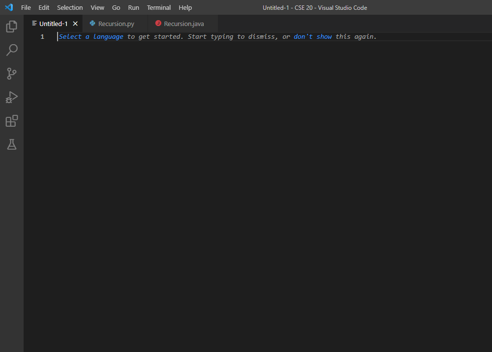
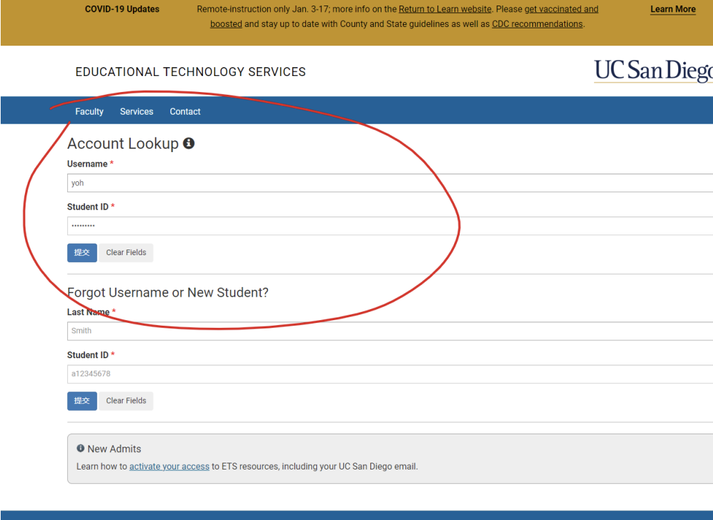
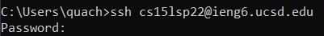
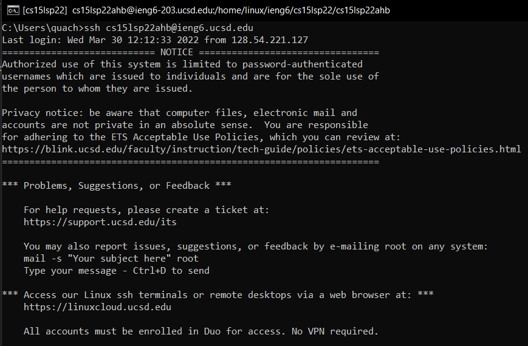
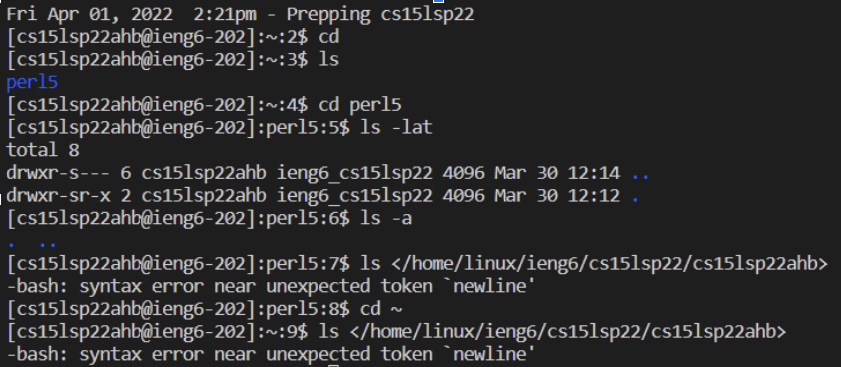
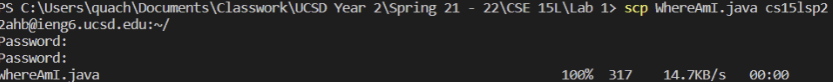
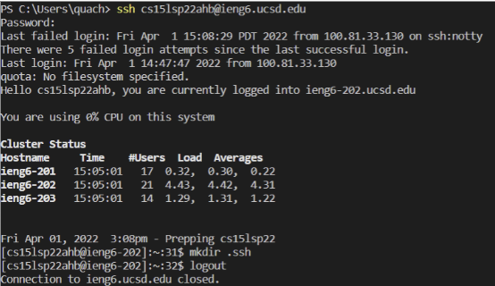
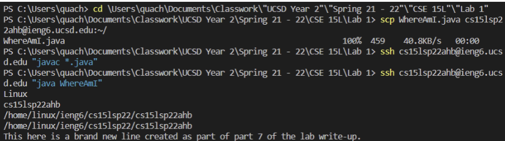

# **Week 2 Lab Report**

This is a lab report written up by Nhan Quach part of the Axolytyl Group led by Elias.

Axolytyl Group Members

| Nhan | Tyler | Kayla | Diego | Jas | Snehal |

---
## Installing VSCode

To get started with setting up for the class and other programming work:
* Head to [Visual Studio Code](https://code.visualstudio.com/Download)!
    * Download the version of VSCode appropriate for your computer (e.g. Windows, Mac, Linux)
* Download any other languages which you would want to code with.
    * For example: :snake: [Python](https://www.python.org/downloads/) or :coffee: [Java](https://www.oracle.com/java/technologies/downloads/) 
---

## Remotely Connecting

Odds are, you are a UCSD student if you are looking for this tutorial! 
One of the kinks which UCSD currently has is that lab login accounts for the Computer Science basement is a bit wonky, so you will need to change your password.
* Head to UCSD's [Educational Technology Services Account Lookup](https://sdacs.ucsd.edu/~icc/index.php) to get started with the process.
* Once you get into the **Account Lookup Results**, you'll see a section for *Additional Accountss* and a button which should say something along the lines of `cs15l<quarter><asc>`. 
    * This is your unique "computer" or sign-in for CS15L.
    * Press on that button.
* Click on `change your password` and go ahead and change your password.
    * Note this may take some time (up to 15 minutes).
    * This will also change your password for ***all*** your related UCSD-based accounts.

## Actually Connecting

Once you get through that far, you can actually start to remotely connect to the server!

* Install [OpenSSH](https://sdacs.ucsd.edu/~icc/index.php)
* Open up your command terminal
    * You can either do this through your computer itself, or through Visual Studio Code 
* Type in `ssh cs15l\<quarter>\<asd>`
* Type in your password.
    * You'll notice that you won't be able to see anything actually get typed up!
    * Don't worry about that, this is just another level of security.
* This is what you should see once you get in:

---
## Trying Some Commands

---
Now that you're on the Remote Client and in the terminal, you can try out some commands!
* cd \<directory name>: Enables you to move through directories.
* ls: Prints out the contents of the directory
* pwd: Prints out the contents of the directory

You can find more commands on what to do with the Command Prompt and Remote Client through [Googling](https://www.thomas-krenn.com/en/wiki/Cmd_commands_under_Windows)!

---
## Moving Files with `scp`

One powerful command available to you when you have access to a remote computer is to copy one file from you local client -- the computer you are actively using -- and the remote!
* Within your terminal type in the command `scp` while also specifying the file and location of where you can to copy something over to.
    * For example, `scp <file> cs15l<quarter><asd>@ieng6.ucsd.edu`
* You'll need to type in your password for the file to copy over, but in the next step we'll be able to get around that!

---
## Setting an SSH Key

To convinence ourselves, we can utilize a key generator which will identify our local client as an authorized user to access our remote computer without needing a password! 
* Open your terminal with Visual Studio Code
* Type in `ssh-keygen`
    * Save your keys within this directory: </Users/<user-name/.ssh/id_rsa>
* Enter in a passphrase
    * You can also leave this empty for no passphrase, but we recommend you do not 
* If you are on Windows, enter this command: `ssh-keygen -t ed25519` 
* Connect to your remote acount as normal
* Enter the command: `mkdir .ssh` then logout
* Within your client terminal, type: `scp <Director you saved the keys in>/id_rsa.pub` and `cs15l<quarter><asd>@ieng6.ucsd.edu:~/.ssh/authorized_keys` 
* Try logging onto your account now! 

---
## Optimizing Remote Running

Now that we've added in all this convinence of logging in without needing a password, we can try to learn how to optimize utilizing a command terminal which should help us use a remote computer faster! 
* Command prompt shortcuts include things such as accessing previously typed commands.
    * This can be achieved by using ⬆️ or ⬇️ keys.
* You can use the `tab` key to quickly autofill commands based on the context of the command and contents of the directory.
* Multiple commands can be typed out at once within a command line using a ;
    * For example: `javac WhereAmI.java; java WhereAmI` will compile and run the WhereAmI file!
* Commands can also be sent out to the remote computer! 
    * For example: `ssh cs15l<quarter><zzz>@ieng6.ucsd.edu "javac *.java; java WhereAmI"` will compile all the .java files and run the WhereAmI file on the remote computer from the local client.
* You can try to combine all these shortcuts to optimize using the remote client. 
