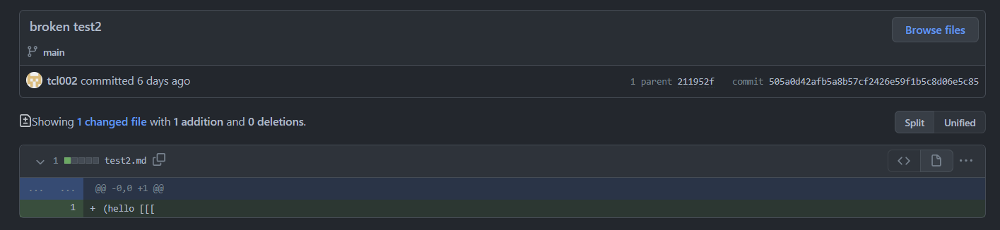
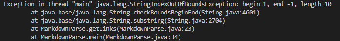
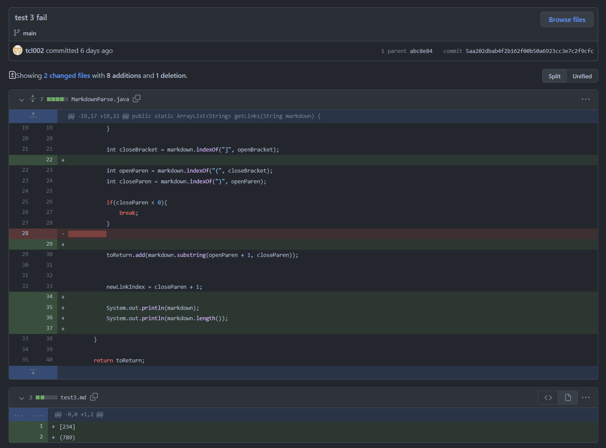
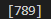

# Week 4: Lab Report 2

Welcome! I hope you enjoyed my previous [lab report](https://ima-quack.github.io/cse15l-lab-reports/lab-report-1/lab-report-1-week2.html) -- you'll notice, however, that it looks slightly different after attempting to clean up my repository a bit. 

Just some reminders: 
- My name is Nhan Quach
- My group leader is Elias
- My team members are as follows:

| Member 1 | Member 2 | Member 3 | Member 4 | Member 5 | Member 6 |
| -------- | -------- | -------- | -------- | -------- | -------- |
| Nhan     | Tyler    | Kayla    | Diego    | Jas      | Snehal   |

This week, Tyler, Jas, and myself all worked closely to resolve some bugs from the lab 3 [markdown-parser](https://github.com/nidhidhamnani/markdown-parser).

---

## Part 1: Reviewing the Code

We started off by reviewing the original code and diagnosising possible issues with the original file. 

**Original Code**:
```
//https://howtodoinjava.com/java/io/java-read-file-to-string-examples/

import java.io.IOException;
import java.nio.file.Files;
import java.nio.file.Path;
import java.util.ArrayList;

public class MarkdownParse {

    public static ArrayList<String> getLinks(String markdown) {
        ArrayList<String> toReturn = new ArrayList<>();
        // find the next [, then find the ], then find the (, then read link upto next )
        int currentIndex = 0;
        while(currentIndex < markdown.length()) {
            int openBracket = markdown.indexOf("[", currentIndex);
            int closeBracket = markdown.indexOf("]", openBracket);
            int openParen = markdown.indexOf("(", closeBracket);
            int closeParen = markdown.indexOf(")", openParen);
            toReturn.add(markdown.substring(openParen + 1, closeParen));
            currentIndex = closeParen + 1;
        }

        return toReturn;
    }


    public static void main(String[] args) throws IOException {
        Path fileName = Path.of(args[0]);
        String content = Files.readString(fileName);
        ArrayList<String> links = getLinks(content);
	    System.out.println(links);
    }
}
```

We speculated that the issue stems from the `public static ArrayList<String> getLinks(String markdown)` method specifically due to some indexing error. To confirm our hypothesis that this is the bug, we needed to do some symptom testing...

---
## Part 2: Symptom Diagnosis 

We ran a modified version of the included `test-file.md` - titled _`new-markdown.md`_ under Tyler's [repo](https://github.com/tcl002/markdown-parser/blob/48f02eaf1cf5fc65150101e1ff28fefd64e3ffb0/new-markdown.md) - which was included with the `MarkdownParse.java` which had contained extra lines, an additional paragraph of text, and made sure that the link was not the end of the file. 


We added in a print statement to the `MarkdownParse.java` so that we could see from our console possible indexing symptoms.

Running our new test case yielded the following issue:


In case the console output wasn't clear: _The `MarkdownParse.java` ran into an indexing issue and would loop between index 77 and 171 infinitly._

---

## Part 3: Bug Fixing

We speculated the possible issue underlying the indexing problem and came down to a fundamental flaw which the `getLinks(String markdown)` method overlooked stemming from the `.indexOf()` method call. 

Since `.indexOf()` returns -1 if the specified value doesn't exist within the remainder of the string, and we add this -1 with 1 through the line `currentIndex = closeParen + 1`, the variable declaration at the beginning of the while loop `int openBracket = markdown.indexOf("[", currentIndex)` would perpetually restart at the beginning of the file if the link was not at the end of the file. 

Thus, we edited our code as such:


After running the fixes our code worked properly.


---

## Part 4: Improving Code and More Bug Testing

We continued the lab trying out two additional test cases which would have made the code fail.

Our [second test](https://github.com/tcl002/markdown-parser/commit/505a0d42afb5a8b57cf2426e59f1b5c8d06e5c85) involved using open paranthesis and open brackets but without any real links nor any closers.



This resulted in the following symptom:



We believed this particular bug was caused due to the code attempting to index at -1 with the `toReturn.add(markdown.substring(openParen + 1, closeParen));` line. This is evident as the failure output reports a symptom `IndexOutOfBoundsException` ending at index -1.

Our [third test](https://github.com/tcl002/markdown-parser/commit/5aa202dbab4f2b162f00b50a6923cc3e7c2f9cfc) involved using a markdown file where there just so happens to have coincidentially been both a () and [] with no letters inbetween them, but they do not represent a text-link relationship.



This resulted in the following failure output: 



While this failure output was much simpler and didn't cause our code to crash like the previous test cases, it was still a faulty _symptom_. The code should have produced an empty list [], but didn't implicating that we had a bug. We concluded that this bug stemmed from the `MarkdownParse.java` lacking an index checker to see if the closed bracket ] was followed immediately by an open parenthesis (. 

---

# That concludes this lab report!