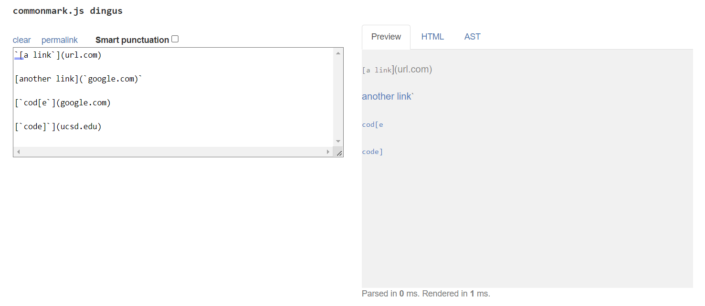
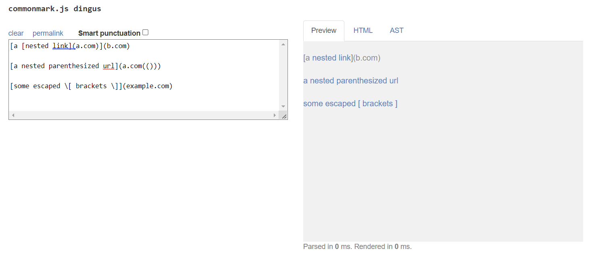
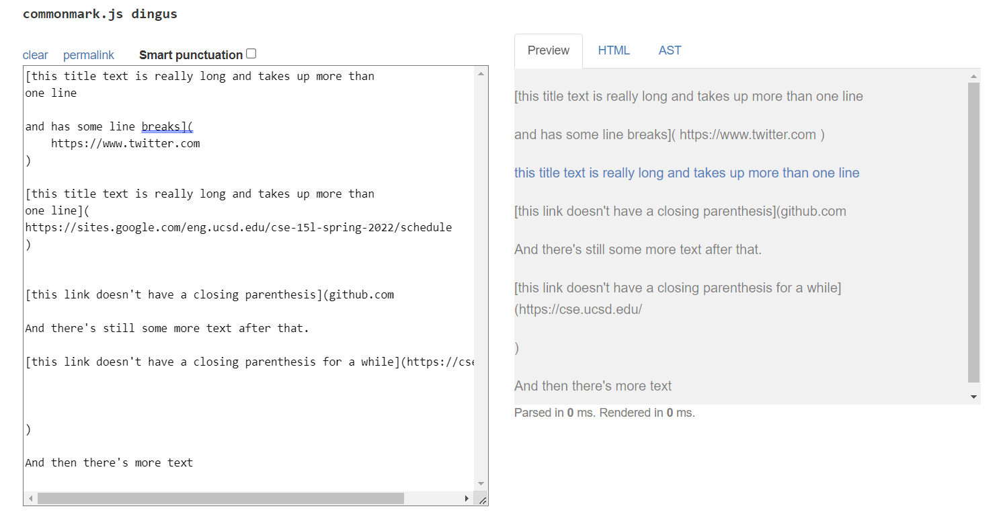

# Week 6: Lab Report 4

Welcome to my fourth lab report! This lab will be going over code debugging.

Just some reminders: 
- My name is Nhan Quach
- My group leader is Elias
- My team members are as follows:

| Member 1 | Member 2 | Member 3 | Member 4 | Member 5 | Member 6 |
| -------- | -------- | -------- | -------- | -------- | -------- |
| Nhan     | Tyler    | Kayla    | Diego    | Jas      | Snehal   |

## Links to the Repositories for MarkdownParse

Mine: [ima_quack](https://github.com/ima-quack/markdown-parser)

Reviewed: [astoriama](https://github.com/astoriama/markdown-parser)

---

# Testing Snippets
For this Lab Report, I will be testing the MarkdownParse.java file with three new testing snippets.

**Snippet 1**
>     `[a link`](url.com)
>
>     [another link](`google.com)`
>     
>     [`cod[e`](google.com)
>
>     [`code]`](ucsd.edu)

The expected output from `getLinks` on **Snippet 1** should be ['google.com, google.com, ucsd.edu]. Based off of the CommonMark demo site.

**Snippet 2**
>     [a [nested link](a.com)](b.com)
>
>     [a nested parenthesized url](a.com(()))
>
>     [some escaped \[ brackets \]](example.com)

The expected output from `getLinks` on **Snippet 2** should be [a.com, a.com(()), example.com]. Based off of the CommonMark demo site.

**Snippet 3**
>     [this title text is really long and takes up more than 
>     one line
> 
>     and has some line breaks](
>          https://www.twitter.com
>     )
> 
>     [this title text is really long and takes up more than 
>     one line](
>     https://sites.google.com/eng.ucsd.edu/cse-15l-spring-2022/schedule
>     )
> 
> 
>     [this link doesn't have a closing parenthesis](github.com
> 
>     And there's still some more text after that.
>
>     [this link doesn't have a closing parenthesis for a while](https://cse.ucsd.edu/
>
>
> 
>     )
>
>     And then there's more text

The expected output from `getLinks` on **Snippet 3** should be [https://sites.google.com/eng.ucsd.edu/cse-15l-spring-2022/schedule]. Based off of the CommonMark demo site.

# Implementation of Snippet Tests

## Personal Repository 

Within my personal implementation of MarkdownParseTest.java, I created some instance variables to populate the result and files of each of the tests. This was so that I can then create a `setUp` method which streamlines the actual test writing.

## Reviewed Repository

Within the MarkdownParseTest.java of the individual who I reviewed, I copied over the same structure as my test implementation. However, you can see the original methodology which the other individual used to create their tests from below.

# Running the Test & Diagnosis

## Personal Repository

